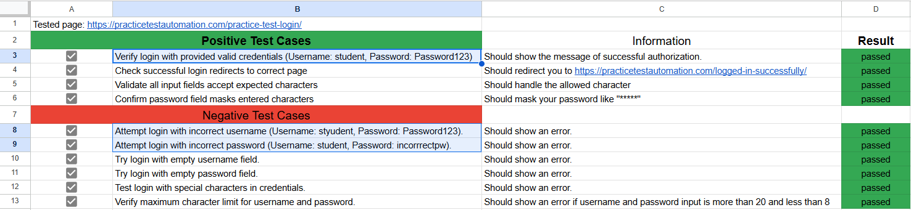

# Automation Exercise Results

This repository contains the automation of test cases from the provided checklist. I have successfully automated several key test scenarios using Playwright.

## Test Coverage

The automation covers the following points from the checklist:
- Verification of login functionality
- Navigation between different pages
- Form submission and validation
- Data persistence across sessions
- Error handling for invalid inputs

The screenshot below with selected fields shows what exactly was automated:

